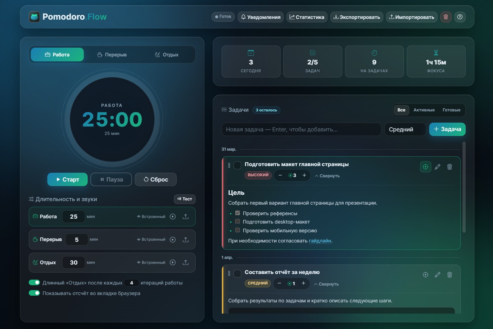
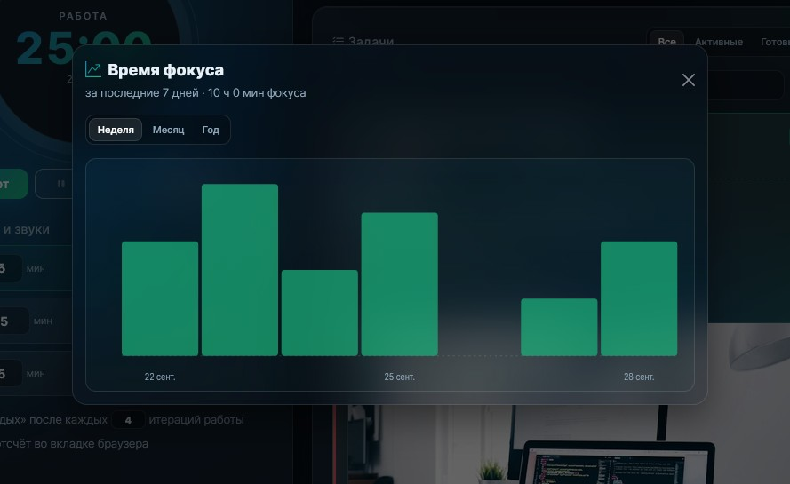

<h1 align="center">
  Pomodoro.Flow 🍅 - stay in focus
</h1>

  <a href="illoprin.github.io/pomodoro-flow">
    Try Pomodoro.Flow
  </a>

 

A modern, feature-rich Pomodoro timer with task management that runs right in your browser. It features a glassmorphism design, dark mode, local data storage, and customizable sound notifications.

  

  

## ✨ Features

* **Flexible modes:** focus, short break, and long break, with automatic mode switching when the timer ends.
* **Task management:** create tasks with low, medium, or high priority, add Markdown descriptions, and track Pomodoro sessions spent on each task.
* **Task focus:** link the timer to a task to track its progress automatically.
* **Custom sounds:** upload your own MP3/WAV files (up to 2 MB). Built-in melodic alerts are generated with the Web Audio API.
* **Statistics:** track total sessions, completed tasks, and today's focus time.
* **Local storage:** tasks, settings, and sounds are saved in your browser's `localStorage`. No server or account required.
* **Export and import:** back up your data as JSON or transfer it between devices.
* **Keyboard shortcuts:** control the timer and tasks from your keyboard.
* **Responsive design:** works beautifully on desktop and mobile devices.
