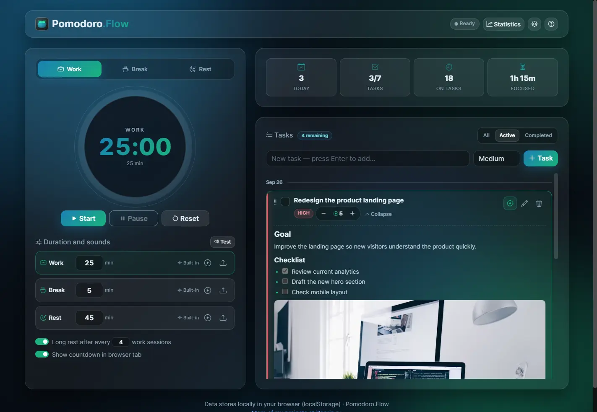
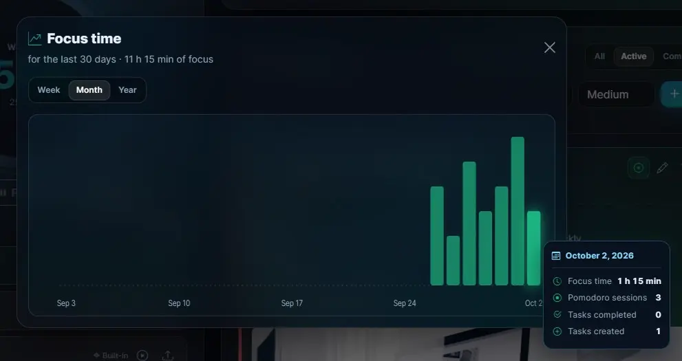

<h1 align="center">
  Pomodoro.Flow 🍅 - оставайся в фокусе
</h1>

  <a href="illoprin.github.io/pomodoro-flow">
    Попробовать Pomodoro.Flow
  </a>

 

Современный и функциональный таймер Pomodoro с управлением задачами, работающий прямо в браузере. Приложение использует стекломорфный дизайн, поддерживает тёмную тему, локальное хранение данных и настройку звуковых уведомлений.

  

### ✨ Особенности

* **Гибкие режимы:** работа, короткий перерыв и длинный отдых. Автоматическое переключение после завершения таймера.
* **Управление задачами:** создавайте задачи с низким, средним или высоким приоритетом, добавляйте описания в Markdown и отслеживайте затраченные помодоро-итерации.
* **Фокус на задаче:** привяжите таймер к задаче, чтобы автоматически учитывать прогресс.
* **Настройка звуков:** загружайте собственные MP3/WAV-файлы (до 2 МБ). Встроенные сигналы генерируются через Web Audio API.
* **Статистика:** отслеживайте общее количество итераций, выполненные задачи и время фокуса за сегодня.
* **Локальное хранение:** задачи, настройки и звуки сохраняются в `localStorage` браузера. Сервер и регистрация не нужны.
* **Экспорт и импорт:** создавайте резервные копии в JSON и переносите данные между устройствами.
* **Горячие клавиши:** управляйте таймером и задачами с клавиатуры.
* **Адаптивный дизайн:** приложение удобно использовать на компьютере и мобильных устройствах.

